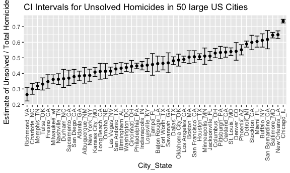
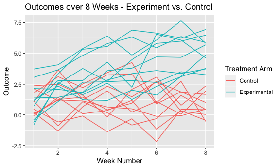
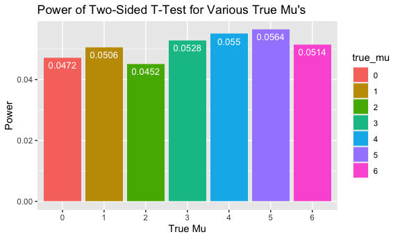
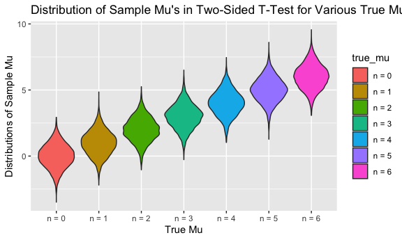
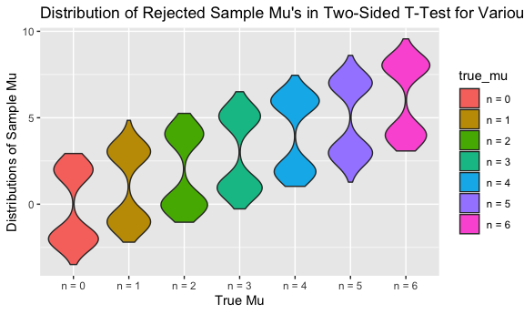

p8105\_hw5\_vd2392.Rmd
================

## Setup

##### General

``` r
knitr::opts_chunk$set(
  echo = TRUE,
  include = TRUE,
  message = FALSE,
  warning = FALSE
)
```

##### Visualizations

``` r
knitr::opts_chunk$set(fig.width = 6,
                      fig.asp = .6,
                      out.width = "90%")
```

##### Installations

``` r
library(tidyverse)
library(ggridges)
library(patchwork)
library(readxl)
```

## Problem 1

This dataset contains 52,000 criminal homicides over the past decade in
50 of the largest American cities. Among the variables of interest
include location of the killing, whether an arrest was made and, in most
cases, basic demographic information of each victim.

``` r
homicide_df =
  read_csv("data/homicide_data/homicide-data.csv") %>%
  mutate(
    city_state = str_c(city, state, sep = "_"),
    resolved = case_when(
      disposition == "Closed without arrest" ~ "unsolved",
      disposition == "Open/No arrest"        ~ "unsolved",
      disposition == "Closed by arrest"      ~ "solved",
    )
  ) %>%
  select(city_state, resolved) %>%
  filter(city_state != "Tulsa_AL")

aggregate_df =
  homicide_df %>%
  group_by(city_state) %>%
  summarize(hom_total = n(),
            hom_unsolved = sum(resolved == "unsolved"))
```

#### Confidence Interval for Baltimore Data

``` r
prop_test = prop.test(
  aggregate_df %>% filter(city_state == "Baltimore_MD") %>% pull(hom_unsolved),
  aggregate_df %>% filter(city_state == "Baltimore_MD") %>% pull(hom_total)
) %>%
  broom::tidy()

knitr::kable(prop_test, "simple", caption = "Data: Homicide Data")
```

|  estimate | statistic | p.value | parameter |  conf.low | conf.high | method                                               | alternative |
| --------: | --------: | ------: | --------: | --------: | --------: | :--------------------------------------------------- | :---------- |
| 0.6455607 |   239.011 |       0 |         1 | 0.6275625 | 0.6631599 | 1-sample proportions test with continuity correction | two.sided   |

Data: Homicide Data

#### Confidence Interval for All Cities

``` r
results_df =
  aggregate_df %>%
  mutate(
    prop_tests = map2(.x = hom_unsolved, .y = hom_total, ~ prop.test(x = .x, n = .y)),
    tidy_tests = map(.x = prop_tests, ~ broom::tidy(.x))
  ) %>%
  select(-prop_tests) %>%
  unnest(tidy_tests) %>%
  select(city_state, estimate, conf.low, conf.high)

knitr::kable(head(results_df), "simple", caption = "Data: Homicide Data")
```

| city\_state     |  estimate |  conf.low | conf.high |
| :-------------- | --------: | --------: | --------: |
| Albuquerque\_NM | 0.3862434 | 0.3372604 | 0.4375766 |
| Atlanta\_GA     | 0.3833505 | 0.3528119 | 0.4148219 |
| Baltimore\_MD   | 0.6455607 | 0.6275625 | 0.6631599 |
| Baton Rouge\_LA | 0.4622642 | 0.4141987 | 0.5110240 |
| Birmingham\_AL  | 0.4337500 | 0.3991889 | 0.4689557 |
| Boston\_MA      | 0.5048860 | 0.4646219 | 0.5450881 |

Data: Homicide Data

#### Confidence Intervals Comparisons of Unsolved Homicides in 50 large US Cities

``` r
results_df %>%
  mutate(city_state = fct_reorder(city_state, estimate)) %>%
  ggplot(aes(x = city_state, y = estimate)) +
  geom_point() +
  geom_errorbar(aes(ymin = conf.low, ymax = conf.high)) +
  theme(axis.text.x = element_text(
    angle = 90,
    vjust = 0.5,
    hjust = 1
  )) +
  ggtitle("CI Intervals for Unsolved Homicides in 50 large US Cities") +
  labs(y = "Estimate of Unsolved / Total Homicides", x = "City_State")
```



## Problem 2

#### List of File Names in RCT Data

``` r
data_path = "data/rct_data/"

rct_files =
  tibble(file = list.files(data_path),)

knitr::kable(head(rct_files), "simple", caption = "Source: RCT Data")
```

| file        |
| :---------- |
| con\_01.csv |
| con\_02.csv |
| con\_03.csv |
| con\_04.csv |
| con\_05.csv |
| con\_06.csv |

Source: RCT Data

#### Extracted RCT Data

``` r
extract = function(path) {
  data = read_csv(path) %>%
    janitor::clean_names()
  data
}

consolidated_rct = rct_files %>%
  mutate(path = str_c(data_path, file),
         data = as.vector(map_dfr(path, extract)))
```

#### Preview of Extracted File Data

This data is nested inside `consolidated_rct` data frame.

``` r
knitr::kable(head(consolidated_rct$data), "simple", caption = "Source: RCT Data")
```

| week\_1 | week\_2 | week\_3 | week\_4 | week\_5 | week\_6 | week\_7 | week\_8 |
| ------: | ------: | ------: | ------: | ------: | ------: | ------: | ------: |
|    0.20 |  \-1.31 |    0.66 |    1.96 |    0.23 |    1.09 |    0.05 |    1.94 |
|    1.13 |  \-0.88 |    1.07 |    0.17 |  \-0.83 |  \-0.31 |    1.58 |    0.44 |
|    1.77 |    3.11 |    2.22 |    3.26 |    3.31 |    0.89 |    1.88 |    1.01 |
|    1.04 |    3.66 |    1.22 |    2.33 |    1.47 |    2.70 |    1.87 |    1.66 |
|    0.47 |  \-0.58 |  \-0.09 |  \-1.37 |  \-0.32 |  \-2.17 |    0.45 |    0.48 |
|    2.37 |    2.50 |    1.59 |  \-0.16 |    2.08 |    3.07 |    0.78 |    2.35 |

Source: RCT Data

#### Preview of Tidied RCT Data

``` r
rct = consolidated_rct %>% {
  bind_cols(select(., file:path), bind_rows(!!!.$data))
}

rct = rct  %>%
  mutate(
    subject_id = case_when(
      substr(file, 0, 3) == "con" ~ paste("Control", substr(file, 5, 6), sep = "_"),
      substr(file, 0, 3) == "exp" ~ paste("Experimental", substr(file, 5, 6), sep = "_")
    ),
    treatment_arm = case_when(
      substr(file, 0, 3) == "con" ~ "Control",
      substr(file, 0, 3) == "exp" ~ "Experimental"
    )
  ) %>%
  select(treatment_arm, subject_id, week_1:week_8) %>%
  pivot_longer(
    week_1:week_8,
    names_to = "week",
    values_to = "result",
    names_prefix = "week_"
  ) %>%
  mutate(week = as.numeric(week))
```

#### Aggregate and Tidied RCT Data

``` r
knitr::kable(head(rct), "simple", caption = "Source: RCT Data")
```

| treatment\_arm | subject\_id | week | result |
| :------------- | :---------- | ---: | -----: |
| Control        | Control\_01 |    1 |   0.20 |
| Control        | Control\_01 |    2 | \-1.31 |
| Control        | Control\_01 |    3 |   0.66 |
| Control        | Control\_01 |    4 |   1.96 |
| Control        | Control\_01 |    5 |   0.23 |
| Control        | Control\_01 |    6 |   1.09 |

Source: RCT Data

#### Outcomes: Control vs. Experimental

As we can see from the plot below, this particular longitudinal study
included a control arm and an experimental arm that was measured over a
specific variable over 8 weeks. The experimental group showed positive
linear relationship over 8 weeks with respect to the outcome of
interest. It seems as though the control group trended towards no
change. This data has to be tested for statistical significance before a
real conclusion can be made.

``` r
ggplot(data = rct,
       aes(
         x = week,
         y = result,
         group = subject_id,
         color = treatment_arm
       )) +
  geom_line(data = rct) +
  ggtitle("Outcomes over 8 Weeks - Experiment vs. Control") +
  labs(y = "Outcome", x = "Week Number", color = "Treatment Arm")
```



## Problem 3

#### Simulation of mu = 0

``` r
n = 30
sigma = 5
alpha = 0.05
mu = 0
trials = 5000

simulation = function(n = n,
                      mu = mu,
                      sigma = sigma,
                      alpha = alpha) {
  data = tibble(x = rnorm(n, mean = mu, sd = sigma))
  data %>%
    summarize(
      mu_hat = mean(x),
      p.value = t.test(x, mu = mu, conf.level = 1 - alpha) %>%
        broom::tidy() %>%
        select(p.value)
    ) %>%
    unnest(p.value) %>%
    mutate(reject_null = as.logical(p.value <= alpha))
}

mu_0_results = rerun(trials, simulation(n, mu, sigma, alpha)) %>% bind_rows
```

#### Experiment, mu = 0

``` r
knitr::kable(head(mu_0_results), "simple", caption = "Source: Experiment")
```

|     mu\_hat |   p.value | reject\_null |
| ----------: | --------: | :----------- |
|   0.0322100 | 0.9717701 | FALSE        |
|   0.8371556 | 0.4377661 | FALSE        |
| \-0.2605804 | 0.7650754 | FALSE        |
|   0.0446849 | 0.9554789 | FALSE        |
|   1.7268196 | 0.0371542 | TRUE         |
|   0.5813668 | 0.5434442 | FALSE        |

Source: Experiment

#### Experiment, mu = 0:6

``` r
output = vector("list", length = 7)

for (i in 1:7) {
  output[[i]] = rerun(trials, simulation(n, i - 1, sigma, alpha)) %>%
    bind_rows
}

sim_results =
  tibble(true_mu = c(0, 1, 2, 3, 4, 5, 6)) %>%
  mutate(estimate_dfs = map(output, bind_rows)) %>%
  unnest(estimate_dfs)
```

#### Experiment with Various True Mu Values

``` r
knitr::kable(head(sim_results), "simple", caption = "Source: Experiment")
```

| true\_mu |     mu\_hat |   p.value | reject\_null |
| -------: | ----------: | --------: | :----------- |
|        0 |   1.4055220 | 0.1600119 | FALSE        |
|        0 | \-0.2565090 | 0.7865968 | FALSE        |
|        0 | \-0.5619363 | 0.5991796 | FALSE        |
|        0 |   0.8891356 | 0.2378572 | FALSE        |
|        0 |   0.6183228 | 0.5157622 | FALSE        |
|        0 | \-0.7837188 | 0.2873477 | FALSE        |

Source: Experiment

#### Power of Two-Sided T-Test for Various True Mu’s

A t-test’s effect size indicates whether or not the difference between
two groups’ averages is large enough to have practical meaning, whether
or not it is statistically significant. The probability that a false
null hypothesis is rejected is referred to as power. In our experiment,
as True Mu changes, it appears that the the power is largely unchanged.

``` r
sim_results %>%
  mutate(true_mu = as.factor(true_mu)) %>%
  group_by(true_mu) %>%
  summarize(proportion = sum(reject_null) / trials) %>%
  ggplot(aes(x = true_mu, y = proportion, fill = true_mu)) +
  geom_bar(stat = "identity") +
  geom_text(
    aes(label = proportion),
    vjust = 1.6,
    color = "white",
    size = 3.5
  ) +
  ggtitle("Power of Two-Sided T-Test for Various True Mu's") +
  labs(y = "Power", x = "True Mu", color = "True Mu")
```



#### Sample Mu’s in Two-Sided T-Test for Various True Mu’s

``` r
all = sim_results %>%
  mutate(true_mu = str_c("n = ", true_mu),
         true_mu = fct_inorder(true_mu)) %>%
  ggplot(aes(x
             = true_mu, y = mu_hat, fill = true_mu)) +
  geom_violin() +
  ggtitle("Distribution of Sample Mu's in Two-Sided T-Test for Various True Mu's") +
  labs(y = "Distributions of Sample Mu", x = "True Mu", color = "True Mu")
```

#### Rejected Sample Mu’s in Two-Sided T-Test for Various True Mu’s

``` r
rejected = sim_results %>%
  filter(reject_null == TRUE) %>%
  mutate(true_mu = str_c("n = ", true_mu),
         true_mu = fct_inorder(true_mu)) %>%
  ggplot(aes(x = true_mu, y = mu_hat, fill = true_mu)) +
  geom_violin() +
  ggtitle("Distribution of Rejected Sample Mu's in Two-Sided T-Test for Various True Mu's") +
  labs(y = "Distributions of Sample Mu", x = "True Mu", color = "True Mu")
```

#### Comparison of Accepted and Rejected Experiment Distributions

The sample mu’s that were rejected trended away from the True Mu,
typically distributed on either poll of the distribution for each True
Mu. This is expected as the power of our experiment represents the
probability a false null hypothesis is rejected at our significance
level of 0.05. These rejected sample means yield statistically unlikely
events outside our 95% confidence interval of our normal distributions.

``` r
all
```



``` r
rejected
```


