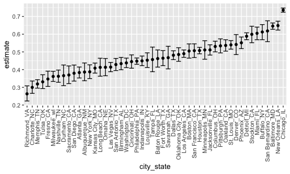
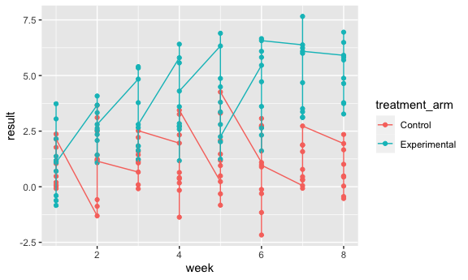
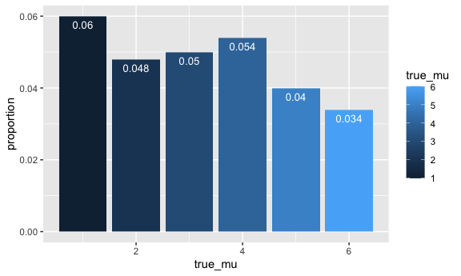
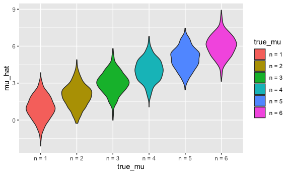
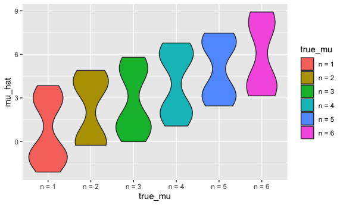

p8105\_hw5\_vd2392.Rmd
================

## Setup

##### General

``` r
knitr::opts_chunk$set(
  echo = TRUE,
  include = TRUE,
  message = FALSE,
  warning = FALSE
)
```

##### Visualizations

``` r
knitr::opts_chunk$set(
  fig.width = 6,
  fig.asp = .6,
  out.width = "90%"
)
```

##### Installations

``` r
library(tidyverse)
library(ggridges)
library(patchwork)
library(readxl)
```

## Problem 1

Dataset: This dataset contains 52,000 criminal homicides over the past
decade in 50 of the largest American cities. Among the variables of
interest include location of the killing, whether an arrest was made
and, in most cases, basic demographic information of each victim.

``` r
homicide_df = 
  read_csv("data/homicide-data.csv") %>% 
  mutate(
    city_state = str_c(city, state, sep = "_"),
    resolved = case_when(
      disposition == "Closed without arrest" ~ "unsolved",
      disposition == "Open/No arrest"        ~ "unsolved",
      disposition == "Closed by arrest"      ~ "solved",
    )
  ) %>% 
  select(city_state, resolved) %>% 
  filter(city_state != "Tulsa_AL")
```

``` r
aggregate_df = 
  homicide_df %>% 
  group_by(city_state) %>% 
  summarize(
    hom_total = n(),
    hom_unsolved = sum(resolved == "unsolved")
  )
```

#### Table Preview

``` r
knitr::kable(head(aggregate_df), "simple", caption = "Source:")
```

| city\_state     | hom\_total | hom\_unsolved |
| :-------------- | ---------: | ------------: |
| Albuquerque\_NM |        378 |           146 |
| Atlanta\_GA     |        973 |           373 |
| Baltimore\_MD   |       2827 |          1825 |
| Baton Rouge\_LA |        424 |           196 |
| Birmingham\_AL  |        800 |           347 |
| Boston\_MA      |        614 |           310 |

Source:

Can I do a prop test for a single city?

``` r
prop_test = prop.test(
  aggregate_df %>% filter(city_state == "Baltimore_MD") %>% pull(hom_unsolved), 
  aggregate_df %>% filter(city_state == "Baltimore_MD") %>% pull(hom_total)) %>% 
  broom::tidy()
```

#### Table Preview

``` r
knitr::kable(prop_test, "simple", caption = "Source:")
```

|  estimate | statistic | p.value | parameter |  conf.low | conf.high | method                                               | alternative |
| --------: | --------: | ------: | --------: | --------: | --------: | :--------------------------------------------------- | :---------- |
| 0.6455607 |   239.011 |       0 |         1 | 0.6275625 | 0.6631599 | 1-sample proportions test with continuity correction | two.sided   |

Source:

Try to iterate ……..

``` r
results_df = 
  aggregate_df %>% 
  mutate(
    prop_tests = map2(.x = hom_unsolved, .y = hom_total, ~prop.test(x = .x, n = .y)),
    tidy_tests = map(.x = prop_tests, ~broom::tidy(.x))
  ) %>% 
  select(-prop_tests) %>% 
  unnest(tidy_tests) %>% 
  select(city_state, estimate, conf.low, conf.high)
```

#### Table Preview

``` r
knitr::kable(results_df, "simple", caption = "Source:")
```

| city\_state        |  estimate |  conf.low | conf.high |
| :----------------- | --------: | --------: | --------: |
| Albuquerque\_NM    | 0.3862434 | 0.3372604 | 0.4375766 |
| Atlanta\_GA        | 0.3833505 | 0.3528119 | 0.4148219 |
| Baltimore\_MD      | 0.6455607 | 0.6275625 | 0.6631599 |
| Baton Rouge\_LA    | 0.4622642 | 0.4141987 | 0.5110240 |
| Birmingham\_AL     | 0.4337500 | 0.3991889 | 0.4689557 |
| Boston\_MA         | 0.5048860 | 0.4646219 | 0.5450881 |
| Buffalo\_NY        | 0.6122841 | 0.5687990 | 0.6540879 |
| Charlotte\_NC      | 0.2998544 | 0.2660820 | 0.3358999 |
| Chicago\_IL        | 0.7358627 | 0.7239959 | 0.7473998 |
| Cincinnati\_OH     | 0.4452450 | 0.4079606 | 0.4831439 |
| Columbus\_OH       | 0.5304428 | 0.5002167 | 0.5604506 |
| Dallas\_TX         | 0.4811742 | 0.4561942 | 0.5062475 |
| Denver\_CO         | 0.5416667 | 0.4846098 | 0.5976807 |
| Detroit\_MI        | 0.5883287 | 0.5687903 | 0.6075953 |
| Durham\_NC         | 0.3659420 | 0.3095874 | 0.4260936 |
| Fort Worth\_TX     | 0.4644809 | 0.4222542 | 0.5072119 |
| Fresno\_CA         | 0.3470226 | 0.3051013 | 0.3913963 |
| Houston\_TX        | 0.5074779 | 0.4892447 | 0.5256914 |
| Indianapolis\_IN   | 0.4493192 | 0.4223156 | 0.4766207 |
| Jacksonville\_FL   | 0.5111301 | 0.4820460 | 0.5401402 |
| Kansas City\_MO    | 0.4084034 | 0.3803996 | 0.4370054 |
| Las Vegas\_NV      | 0.4141926 | 0.3881284 | 0.4407395 |
| Long Beach\_CA     | 0.4126984 | 0.3629026 | 0.4642973 |
| Los Angeles\_CA    | 0.4900310 | 0.4692208 | 0.5108754 |
| Louisville\_KY     | 0.4531250 | 0.4120609 | 0.4948235 |
| Memphis\_TN        | 0.3190225 | 0.2957047 | 0.3432691 |
| Miami\_FL          | 0.6048387 | 0.5685783 | 0.6400015 |
| Milwaukee\_wI      | 0.3614350 | 0.3333172 | 0.3905194 |
| Minneapolis\_MN    | 0.5109290 | 0.4585150 | 0.5631099 |
| Nashville\_TN      | 0.3624511 | 0.3285592 | 0.3977401 |
| New Orleans\_LA    | 0.6485356 | 0.6231048 | 0.6731615 |
| New York\_NY       | 0.3875598 | 0.3494421 | 0.4270755 |
| Oakland\_CA        | 0.5364308 | 0.5040588 | 0.5685037 |
| Oklahoma City\_OK  | 0.4851190 | 0.4467861 | 0.5236245 |
| Omaha\_NE          | 0.4132029 | 0.3653146 | 0.4627477 |
| Philadelphia\_PA   | 0.4478103 | 0.4300380 | 0.4657157 |
| Phoenix\_AZ        | 0.5514223 | 0.5184825 | 0.5839244 |
| Pittsburgh\_PA     | 0.5340729 | 0.4942706 | 0.5734545 |
| Richmond\_VA       | 0.2634033 | 0.2228571 | 0.3082658 |
| Sacramento\_CA     | 0.3696809 | 0.3211559 | 0.4209131 |
| San Antonio\_TX    | 0.4285714 | 0.3947772 | 0.4630331 |
| San Bernardino\_CA | 0.6181818 | 0.5576628 | 0.6753422 |
| San Diego\_CA      | 0.3796095 | 0.3354259 | 0.4258315 |
| San Francisco\_CA  | 0.5067873 | 0.4680516 | 0.5454433 |
| Savannah\_GA       | 0.4674797 | 0.4041252 | 0.5318665 |
| St. Louis\_MO      | 0.5396541 | 0.5154369 | 0.5636879 |
| Stockton\_CA       | 0.5990991 | 0.5517145 | 0.6447418 |
| Tampa\_FL          | 0.4567308 | 0.3881009 | 0.5269851 |
| Tulsa\_OK          | 0.3310463 | 0.2932349 | 0.3711192 |
| Washington\_DC     | 0.4379182 | 0.4112495 | 0.4649455 |

Source:

``` r
results_df %>% 
  mutate(city_state = fct_reorder(city_state, estimate)) %>% 
  ggplot(aes(x = city_state, y = estimate)) +
  geom_point() + 
  geom_errorbar(aes(ymin = conf.low, ymax = conf.high)) + 
  theme(axis.text.x = element_text(angle = 90, vjust = 0.5, hjust = 1))
```



## Problem 2

``` r
data_path = "data/p2_data/"

df = 
  tibble(
    file = list.files(data_path),
  )

knitr::kable(df, "simple", caption = "Source:")
```

| file        |
| :---------- |
| con\_01.csv |
| con\_02.csv |
| con\_03.csv |
| con\_04.csv |
| con\_05.csv |
| con\_06.csv |
| con\_07.csv |
| con\_08.csv |
| con\_09.csv |
| con\_10.csv |
| exp\_01.csv |
| exp\_02.csv |
| exp\_03.csv |
| exp\_04.csv |
| exp\_05.csv |
| exp\_06.csv |
| exp\_07.csv |
| exp\_08.csv |
| exp\_09.csv |
| exp\_10.csv |

Source:

#### Table Preview

``` r
extract = function(path) {
 data = read_csv(path) %>% 
  janitor::clean_names()
 data
}


new = df %>% 
  mutate(
    path = str_c(data_path, file),
    data = as.vector(map_dfr(path, extract))
  )

new$data
```

    ## # A tibble: 20 x 8
    ##    week_1 week_2 week_3 week_4 week_5 week_6 week_7 week_8
    ##     <dbl>  <dbl>  <dbl>  <dbl>  <dbl>  <dbl>  <dbl>  <dbl>
    ##  1   0.2  -1.31    0.66   1.96   0.23   1.09   0.05   1.94
    ##  2   1.13 -0.88    1.07   0.17  -0.83  -0.31   1.58   0.44
    ##  3   1.77  3.11    2.22   3.26   3.31   0.89   1.88   1.01
    ##  4   1.04  3.66    1.22   2.33   1.47   2.7    1.87   1.66
    ##  5   0.47 -0.580  -0.09  -1.37  -0.32  -2.17   0.45   0.48
    ##  6   2.37  2.5     1.59  -0.16   2.08   3.07   0.78   2.35
    ##  7   0.03  1.21    1.13   0.64   0.49  -0.12  -0.07   0.46
    ##  8  -0.08  1.42    0.09   0.36   1.18  -1.16   0.33  -0.44
    ##  9   0.08  1.24    1.44   0.41   0.95   2.75   0.3    0.03
    ## 10   2.14  1.15    2.52   3.44   4.26   0.97   2.73  -0.53
    ## 11   3.05  3.67    4.84   5.8    6.33   5.46   6.38   5.91
    ## 12  -0.84  2.63    1.64   2.58   1.24   2.32   3.11   3.78
    ## 13   2.15  2.08    1.82   2.84   3.36   3.61   3.37   3.74
    ## 14  -0.62  2.54    3.78   2.73   4.49   5.82   6      6.49
    ## 15   0.7   3.33    5.34   5.57   6.9    6.66   6.24   6.95
    ## 16   3.73  4.08    5.4    6.41   4.87   6.09   7.66   5.83
    ## 17   1.18  2.35    1.23   1.17   2.02   1.61   3.13   4.88
    ## 18   1.37  1.43    1.84   3.6    3.8    4.72   4.68   5.7 
    ## 19  -0.4   1.08    2.66   2.7    2.8    2.64   3.51   3.27
    ## 20   1.09  2.8     2.8    4.3    2.25   6.57   6.09   4.64

### Part 3

``` r
final = new %>% {
  bind_cols(select(., file:path), bind_rows(!!!.$data))
}

final = final  %>% 
  mutate(
    subject_id = case_when(
      substr(file, 0, 3) == "con" ~ paste("Control", substr(file, 5, 6), sep = "_"),
      substr(file, 0, 3) == "exp" ~ paste("Experimental", substr(file, 5, 6), sep = "_")
    ),
    treatment_arm = case_when(
      substr(file, 0, 3) == "con" ~ "Control",
      substr(file, 0, 3) == "exp" ~ "Experimental"
    )
  ) %>% 
  select(
    treatment_arm, subject_id, week_1:week_8
  ) %>% 
  pivot_longer(
    week_1:week_8,
    names_to = "week",
    values_to = "result",
    names_prefix = "week_"
  ) %>% 
  mutate(
    week = as.numeric(week)
  )

final
```

    ## # A tibble: 160 x 4
    ##    treatment_arm subject_id  week result
    ##    <chr>         <chr>      <dbl>  <dbl>
    ##  1 Control       Control_01     1   0.2 
    ##  2 Control       Control_01     2  -1.31
    ##  3 Control       Control_01     3   0.66
    ##  4 Control       Control_01     4   1.96
    ##  5 Control       Control_01     5   0.23
    ##  6 Control       Control_01     6   1.09
    ##  7 Control       Control_01     7   0.05
    ##  8 Control       Control_01     8   1.94
    ##  9 Control       Control_02     1   1.13
    ## 10 Control       Control_02     2  -0.88
    ## # … with 150 more rows

``` r
#, color = subject_id
ggplot(data = final, aes(x = week, y = result, color = treatment_arm)) + 
  geom_point(data = final) + 
  geom_line(data = final, aes(x = week, y = result, color = treatment_arm))
```


\#\#\# Problem 3

``` r
n = 30
sigma = 5
alpha = 0.05
mu = 0

simulation = function(n = n, mu = mu, sigma = sigma, alpha = alpha) {
  data = tibble(
    x = rnorm(n, mean = mu, sd = sigma)
  )
  data %>% 
    summarize(
      mu_hat = mean(x),
      p.value = t.test(x, mu = mu, conf.level = 1 - alpha) %>% 
        broom::tidy() %>% 
        select(p.value)
    ) %>% 
    unnest(p.value) %>% 
    mutate(
      reject = as.logical(p.value < alpha)
    )
}
```

``` r
output = vector("list", length = 6)

trials = 500

for (i in 1:6) {
  output[[i]] = rerun(trials, simulation(n, i, sigma, alpha)) %>% 
  bind_rows
}

sim_results = 
  tibble(true_mu = c(1,2,3,4,5,6)) %>% 
  mutate(
    estimate_dfs = map(output, bind_rows)) %>% 
  unnest(estimate_dfs)
sim_results
```

    ## # A tibble: 3,000 x 4
    ##    true_mu  mu_hat p.value reject
    ##      <dbl>   <dbl>   <dbl> <lgl> 
    ##  1       1  2.35    0.102  FALSE 
    ##  2       1 -0.123   0.180  FALSE 
    ##  3       1 -0.770   0.0424 TRUE  
    ##  4       1 -0.174   0.180  FALSE 
    ##  5       1  0.0674  0.375  FALSE 
    ##  6       1 -0.457   0.131  FALSE 
    ##  7       1  2.31    0.0368 TRUE  
    ##  8       1  2.33    0.221  FALSE 
    ##  9       1  1.58    0.462  FALSE 
    ## 10       1  1.29    0.771  FALSE 
    ## # … with 2,990 more rows

## Plots

## <http://www.sthda.com/english/wiki/ggplot2-barplots-quick-start-guide-r-software-and-data-visualization>

true mu by sum(pvalue \> .05) / sum(trials at true mu) (0 - 6) vs. (\~5%
…)

``` r
sim_results %>% 
  group_by(true_mu) %>% 
  summarize(
    proportion = sum(reject) / trials
  ) %>% 
  ggplot(aes(x = true_mu, y = proportion, fill=true_mu)) +
    geom_bar(stat="identity")+
    geom_text(aes(label=proportion), vjust=1.6, color="white", size=3.5)
```



## Plot 2

true mu by avg(mu\_hat over 5000 trials)

``` r
sim_results %>% 
  mutate(
    true_mu = str_c("n = ", true_mu),
    true_mu = fct_inorder(true_mu)) %>% 
  ggplot(aes(x = true_mu, y = mu_hat, fill = true_mu)) + 
    geom_violin()
```


true mu by avg(mu\_har for subset of 5000 trials where rejected)

``` r
sim_results %>% 
  filter(
    p.value < 0.05
  ) %>% 
  mutate(
    true_mu = str_c("n = ", true_mu),
    true_mu = fct_inorder(true_mu)) %>% 
  ggplot(aes(x = true_mu, y = mu_hat, fill = true_mu)) + 
    geom_violin()
```


